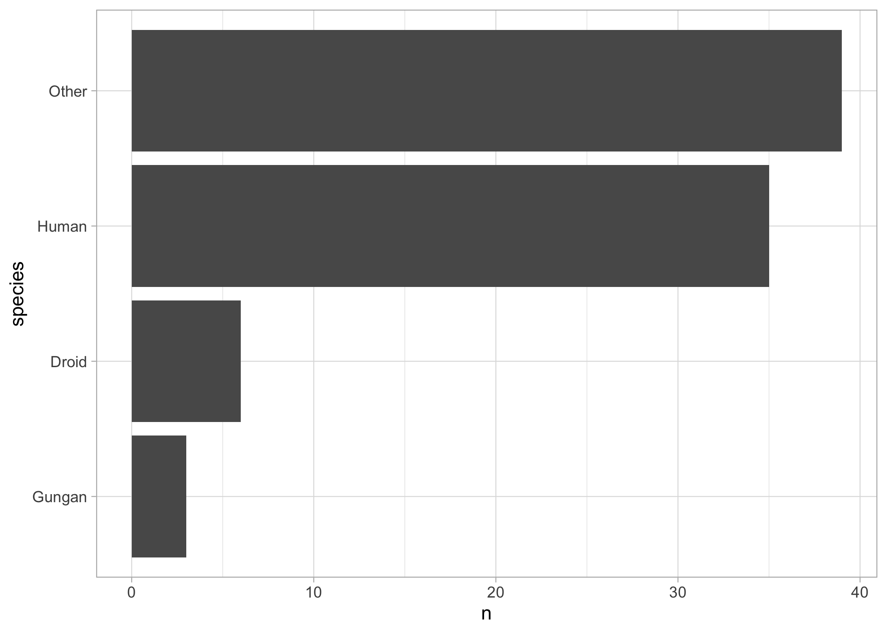

# Motivation

Below are some notes I have taken on David Robinson's screencasts, with tips and tricks I use for my own `R` peregrinations. Hopefully, these notes will be useful to others.

It took me some time to fully transition from base `R` to the `Tidyverse`. I really clicked when I started watching screencasts by [David Robinson](http://varianceexplained.org/){:target="_blank" rel="noopener"} on his [Youtube channel](https://www.youtube.com/user/safe4democracy/featured){:target="_blank" rel="noopener"}. 

Each week, he goes live for an hour or so, and does exploratory analyses in `R` with data he has never seen before (!). The data come from the [#TidyTuesday project](https://github.com/rfordatascience/tidytuesday){:target="_blank" rel="noopener"} brought to us by the [R for Data Science Online Learning Community](https://www.rfordatasci.com/){:target="_blank" rel="noopener"}. This is an awesome initiative, check out the [beautiful data visualisations](https://twitter.com/hashtag/tidytuesday){:target="_blank" rel="noopener"} on Twitter. 

David Robinson shares [the #RStats code](https://github.com/dgrtwo/data-screencasts){:target="_blank" rel="noopener"} he writes during his screencasts, and provides [annotations](https://github.com/dgrtwo/data-screencasts/tree/master/screencast-annotations){:target="_blank" rel="noopener"} for us to grasp at once what the screencast is about, and what the main steps of the analyses are (including the `R` functions he used).     

Check out David Robinson's talk [Ten Tremendous Tricks for Tidyverse](https://www.youtube.com/watch?v=NDHSBUN_rVU){:target="_blank" rel="noopener"}. You might also be interested in Emily Robinson's talk [The Lesser Known Stars of the Tidyverse](https://www.youtube.com/watch?v=ax4LXQ5t38k){:target="_blank" rel="noopener"}.

Let's get to it. First data wrangling, second data visualisation. 

# Setting the scene

Load the tidyverse suite of packages:

```r
library(tidyverse)
```

```
## ── Attaching packages ──────────────────────────────────────────────────────────────── tidyverse 1.3.0 ──
```

```
## ✓ ggplot2 3.3.2     ✓ purrr   0.3.4
## ✓ tibble  3.0.3     ✓ dplyr   1.0.1
## ✓ tidyr   1.1.1     ✓ stringr 1.4.0
## ✓ readr   1.3.1     ✓ forcats 0.5.0
```

```
## ── Conflicts ─────────────────────────────────────────────────────────────────── tidyverse_conflicts() ──
## x dplyr::filter() masks stats::filter()
## x dplyr::lag()    masks stats::lag()
```

By the way, if you need to explore the functions of a package, a trick is to use the autocompletion in `RStudio`. Just type in `?package_name::` and you should see the functions of the `package_name` package in a pull-down menu. 

Now set [the theme](https://ggplot2.tidyverse.org/reference/ggtheme.html){:target="_blank" rel="noopener"} you like for data visualisation with `ggplot2`:

```r
theme_set(theme_light())
```

For illustration, I will use the `starwars` dataset that comes with the `tidyverse` packages:

```r
data("starwars")
starwars_raw <- starwars
```

# Data wrangling

## Inspect the data

Use the viewer to inspect your data:

```r
starwars_raw %>%
  View()
```

The tibble format is great to double check the format of your columns:

```r
starwars_raw
```

```
## # A tibble: 87 x 14
##    name  height  mass hair_color skin_color eye_color birth_year sex   gender
##    <chr>  <int> <dbl> <chr>      <chr>      <chr>          <dbl> <chr> <chr> 
##  1 Luke…    172    77 blond      fair       blue            19   male  mascu…
##  2 C-3PO    167    75 <NA>       gold       yellow         112   none  mascu…
##  3 R2-D2     96    32 <NA>       white, bl… red             33   none  mascu…
##  4 Dart…    202   136 none       white      yellow          41.9 male  mascu…
##  5 Leia…    150    49 brown      light      brown           19   fema… femin…
##  6 Owen…    178   120 brown, gr… light      blue            52   male  mascu…
##  7 Beru…    165    75 brown      light      blue            47   fema… femin…
##  8 R5-D4     97    32 <NA>       white, red red             NA   none  mascu…
##  9 Bigg…    183    84 black      light      brown           24   male  mascu…
## 10 Obi-…    182    77 auburn, w… fair       blue-gray       57   male  mascu…
## # … with 77 more rows, and 5 more variables: homeworld <chr>, species <chr>,
## #   films <list>, vehicles <list>, starships <list>
```

`chr`, `int`, `dbl`, `fct` and `list` are for characters, integers, doubles, factors and lists respectively. 

We are gonna use only a few columns of the original dataset:

```r
starwars <- starwars_raw %>%
  select(name, gender, species, mass, height)
```

## Count, count, count

### Crude counting

To get a sense of the data, count stuff and use `sort = TRUE` to arrange things by decreasing counts:

```r
starwars %>% 
  count(name, sort = TRUE) # does a character appear only once
```

```
## # A tibble: 87 x 2
##    name                    n
##    <chr>               <int>
##  1 Ackbar                  1
##  2 Adi Gallia              1
##  3 Anakin Skywalker        1
##  4 Arvel Crynyd            1
##  5 Ayla Secura             1
##  6 Bail Prestor Organa     1
##  7 Barriss Offee           1
##  8 BB8                     1
##  9 Ben Quadinaros          1
## 10 Beru Whitesun lars      1
## # … with 77 more rows
```

```r
starwars %>% 
  count(gender, sort = TRUE) # 
```

```
## # A tibble: 3 x 2
##   gender        n
##   <chr>     <int>
## 1 masculine    66
## 2 feminine     17
## 3 <NA>          4
```

Filter out missing values before counting:

```r
starwars %>% 
  filter(!is.na(gender)) %>% # filter out missing values
  count(gender, sort = TRUE)
```

```
## # A tibble: 2 x 2
##   gender        n
##   <chr>     <int>
## 1 masculine    66
## 2 feminine     17
```

Count along more than one variable:

```r
starwars %>% 
  count(species, gender, sort = TRUE) # 
```

```
## # A tibble: 42 x 3
##    species  gender        n
##    <chr>    <chr>     <int>
##  1 Human    masculine    26
##  2 Human    feminine      9
##  3 Droid    masculine     5
##  4 <NA>     <NA>          4
##  5 Gungan   masculine     3
##  6 Mirialan feminine      2
##  7 Wookiee  masculine     2
##  8 Zabrak   masculine     2
##  9 Aleena   masculine     1
## 10 Besalisk masculine     1
## # … with 32 more rows
```

### Weighted counting

You may want to use the `wt` argument to get a count weighted by another variable. Compare the call to `count()` with and without the `wt` argument in the example below. When `wt = mass` is used, we compute `sum(mass)` for each species, otherwise we compute the number of rows in each species:

```r
starwars %>%
  count(species, wt = mass)
```

```
## # A tibble: 38 x 2
##    species       n
##    <chr>     <dbl>
##  1 Aleena       15
##  2 Besalisk    102
##  3 Cerean       82
##  4 Chagrian      0
##  5 Clawdite     55
##  6 Droid       279
##  7 Dug          40
##  8 Ewok         20
##  9 Geonosian    80
## 10 Gungan      148
## # … with 28 more rows
```

```r
starwars %>%
  count(species)
```

```
## # A tibble: 38 x 2
##    species       n
##    <chr>     <int>
##  1 Aleena        1
##  2 Besalisk      1
##  3 Cerean        1
##  4 Chagrian      1
##  5 Clawdite      1
##  6 Droid         6
##  7 Dug           1
##  8 Ewok          1
##  9 Geonosian     1
## 10 Gungan        3
## # … with 28 more rows
```

You can add the counts to your tibble by using `add_count()`. Check out the `n` column:

```r
starwars %>%
  add_count(species, wt = mass)
```

```
## # A tibble: 87 x 6
##    name               gender    species  mass height     n
##    <chr>              <chr>     <chr>   <dbl>  <int> <dbl>
##  1 Luke Skywalker     masculine Human      77    172 1821.
##  2 C-3PO              masculine Droid      75    167  279 
##  3 R2-D2              masculine Droid      32     96  279 
##  4 Darth Vader        masculine Human     136    202 1821.
##  5 Leia Organa        feminine  Human      49    150 1821.
##  6 Owen Lars          masculine Human     120    178 1821.
##  7 Beru Whitesun lars feminine  Human      75    165 1821.
##  8 R5-D4              masculine Droid      32     97  279 
##  9 Biggs Darklighter  masculine Human      84    183 1821.
## 10 Obi-Wan Kenobi     masculine Human      77    182 1821.
## # … with 77 more rows
```

### Complete counting

When you count by two or more variables, it may happen that you don't have all combinations. No worries, you're covered with `complete()`. Compare the call to `complete()` without and with in the example below. The Aleena species has no feminine representative, but this info is implicit. When `complete()` is used, a row is added with a `NA` for feminine gender: 

```r
starwars %>% 
  filter(species %in% c('Aleena','Droid')) %>%
  count(species, gender)
```

```
## # A tibble: 3 x 3
##   species gender        n
##   <chr>   <chr>     <int>
## 1 Aleena  masculine     1
## 2 Droid   feminine      1
## 3 Droid   masculine     5
```

```r
starwars %>% 
  filter(species %in% c('Aleena','Droid')) %>%
  count(species, gender) %>%
  complete(species, gender)
```

```
## # A tibble: 4 x 3
##   species gender        n
##   <chr>   <chr>     <int>
## 1 Aleena  feminine     NA
## 2 Aleena  masculine     1
## 3 Droid   feminine      1
## 4 Droid   masculine     5
```

If you don't like `NA`, you may use a `0` instead with the `fill = list()` argument:

```r
starwars %>% 
  filter(species %in% c('Aleena','Droid')) %>%
  count(species, gender) %>%
  complete(species, gender, fill = list(n = 0))
```

```
## # A tibble: 4 x 3
##   species gender        n
##   <chr>   <chr>     <dbl>
## 1 Aleena  feminine      0
## 2 Aleena  masculine     1
## 3 Droid   feminine      1
## 4 Droid   masculine     5
```

### Computations across columns

There is a new function in `dplyr` which allows applying functions to columns of a dataset. In the example below, I compute the mean and standard deviation (storing them in a list) across all columns with numeric format (`where(is.numeric)`), while taking care of the missing values (`na.rm = TRUE`):

```r
starwars %>%
  summarize(across(where(is.numeric), 
                   list(mean = ~mean(.x, na.rm = TRUE), 
                        sd = ~sd(.x, na.rm = TRUE))))
```

```
## # A tibble: 1 x 4
##   mass_mean mass_sd height_mean height_sd
##       <dbl>   <dbl>       <dbl>     <dbl>
## 1      97.3    169.        174.      34.8
```
Just use `list(mean = mean, sd = sd)` if no missing values. Also check out `across(starts_with())` and `across(everywhere())` for even more flexibility. 

### The decade trick

Probably the best of his tricks, Dave Robinson often uses the integer division `%/%` to count things at coarse levels. For example, here how you would count the number of character in classes of height of width 10 centimeters. 

```r
starwars %>%
  count(height_classes = 10 * (height %/% 10))
```

```
## # A tibble: 18 x 2
##    height_classes     n
##             <dbl> <int>
##  1             60     1
##  2             70     1
##  3             80     1
##  4             90     4
##  5            110     1
##  6            120     1
##  7            130     1
##  8            150     3
##  9            160    10
## 10            170    15
## 11            180    20
## 12            190    12
## 13            200     4
## 14            210     2
## 15            220     3
## 16            230     1
## 17            260     1
## 18             NA     6
```

This trick also works for years `count(year = 10 * (year %/% 10))`, think of decades for example, hence the 'decade trick'. 

You may tuned a bit the output by changing the name of the `n` column:

```r
starwars %>%
  count(height_classes = 10 * (height %/% 10), 
        name = "class_size")
```

```
## # A tibble: 18 x 2
##    height_classes class_size
##             <dbl>      <int>
##  1             60          1
##  2             70          1
##  3             80          1
##  4             90          4
##  5            110          1
##  6            120          1
##  7            130          1
##  8            150          3
##  9            160         10
## 10            170         15
## 11            180         20
## 12            190         12
## 13            200          4
## 14            210          2
## 15            220          3
## 16            230          1
## 17            260          1
## 18             NA          6
```

### Lumping levels together

It has always been a nightmare to deal with factors in `R`. The package `forcats` is a game changer. For example, the function `fct_lump` is useful to manipulate factors with many levels. You just lump levels together by preserving the `n` most common values, the other levels are lumped in a new `Other` level:

```r
starwars %>%
  filter(!is.na(species)) %>%
  count(species = fct_lump(f = species, n = 3))
```

```
## # A tibble: 4 x 2
##   species     n
##   <fct>   <int>
## 1 Droid       6
## 2 Gungan      3
## 3 Human      35
## 4 Other      39
```

If you'd like to get rid of `Other`, just pipe a `filter(species != 'Other')`. 

## Pipe a (G)LM

Statistical analyses can easily be piped in your tidyverse workflow. You will find two simple examples below. Check out the [`broom` package](https://cran.r-project.org/web/packages/broom/vignettes/broom.html){:target="_blank" rel="noopener"} which cleans up the messy output of built-in `R` functions like `lm` or `glm`. Also, recommended is [`tidymodels`](https://www.tidymodels.org/){:target="_blank" rel="noopener"} a collection of packages for doing statistical analyses in the machine learning spirit. If you want to learn `tidymodels` by examples, I strongly recommend [Julia Silge's screencasts](https://juliasilge.com/category/tidymodels/){:target="_blank" rel="noopener"} and her [supervised machine learning course](https://juliasilge.com/blog/tidymodels-ml-course/){:target="_blank" rel="noopener"}. 

### Simple linear regression


```r
starwars %>%
  lm(mass ~ height, data = .) %>%
  anova()
```

```
## Analysis of Variance Table
## 
## Response: mass
##           Df  Sum Sq Mean Sq F value Pr(>F)
## height     1   29854   29854  1.0404  0.312
## Residuals 57 1635658   28696
```

Here is the tidy version of it:

```r
starwars %>%
  lm(mass ~ height, data = .) %>%
  broom::tidy()
```

```
## # A tibble: 2 x 5
##   term        estimate std.error statistic p.value
##   <chr>          <dbl>     <dbl>     <dbl>   <dbl>
## 1 (Intercept)  -13.8     111.       -0.124   0.902
## 2 height         0.639     0.626     1.02    0.312
```

Get several summary statistics, including the $R^2$ and the AIC:

```r
starwars %>%
  lm(mass ~ height, data = .) %>%
  broom::glance()
```

```
## # A tibble: 1 x 12
##   r.squared adj.r.squared sigma statistic p.value    df logLik   AIC   BIC
##       <dbl>         <dbl> <dbl>     <dbl>   <dbl> <dbl>  <dbl> <dbl> <dbl>
## 1    0.0179      0.000696  169.      1.04   0.312     1  -386.  777.  783.
## # … with 3 more variables: deviance <dbl>, df.residual <int>, nobs <int>
```

### Logistic regression


```r
starwars %>%
  mutate(human = if_else(species == 'Human', 1, 0)) %>%
  glm(human ~ height, data = ., family = "binomial") %>%
  summary()
```

Here is the tidy version of it:

```r
starwars %>%
  mutate(human = if_else(species == 'Human', 1, 0)) %>%
  glm(human ~ height, data = ., family = "binomial") %>%
  broom::tidy()
```

Let's have a look to the fitted values and residuals:

```r
starwars %>%
  mutate(human = if_else(species == 'Human', 1, 0)) %>%
  glm(human ~ height, data = ., family = "binomial") %>%
  broom::augment()
```

## Miscealleanous


```r
?parse_number
parse_number("$1000")
```

```
## [1] 1000
```

```r
parse_number("1,234,567.78")
```

```
## [1] 1234568
```

# Data visualisation

## Ordering bars in a bar plot

Compare:

```r
starwars %>%
  filter(!is.na(species)) %>%
  count(species = fct_lump(species, 3)) %>%
  ggplot(aes(x = n, y = species)) + 
  geom_col()
```

<!-- -->

with:

```r
starwars %>%
  filter(!is.na(species)) %>%
  count(species = fct_lump(species, 3)) %>%
  mutate(species = fct_reorder(species, n)) %>%
  ggplot(aes(x = n, y = species)) + 
  geom_col()
```

<!-- -->

We have reordered the `species` factor by `n` which is created by the call to `count()`, and the `Droid` and `Gungan` species get ordered adequately. The function `fct_reorder` is another nice feature of the `forcats` package. 

## Ordering bars within bar plots

When we use `facet_wrap()` to get a barplot for each level of a factor, the reordering should apply within the levels of this factor. The `fct_reorder` call above won't work:

```r
starwars %>%
  filter(!is.na(species)) %>%
  count(species = fct_lump(species, 5),
        gender) %>%
  mutate(species = fct_reorder(species, n)) %>%
  ggplot(aes(x = n, y = species)) + 
  geom_col() +
  facet_wrap(vars(gender))
```

<!-- -->

There is exactly what we need in the `tidtext` package. This is the function `reorder_within()` which works with `scale_y_reordered`:

```r
library(tidytext)
starwars %>%
  filter(!is.na(species)) %>%
  count(species = fct_lump(species, 5),
        gender) %>%
  mutate(species = reorder_within(species, n, gender)) %>%
  ggplot(aes(x = n, y = species)) + 
  geom_col() +
  scale_y_reordered() + 
  facet_wrap(vars(gender))
```

<!-- -->

## Little tricks that I often don't remember

### Free the scales

The argument `scales = "free"` is useful to remember when using `facet_wrap()`. It allows the X and Y axes to have their own scale in each panel. You can choose to have a free scale on the X axis only with `scales = "free_x"`, same thing for the Y axis with `scales = "free_y"`. 

### Flip coordinates 

We used to add a `coord_flip()` following `geom_col()` to improve the reading of a bar plot by having the categories on the Y axis. This is no longer useful as we may simply permute the variables in the `aes()`.

### Title too long

Also, in a `facet_wrap()`, the title of each panel might be too long so that it doesn't read properly. There are two ways to fix that. Either you decrease the font size with a `theme(strip.text = element_text(size = 6))` or you truncate the title with a `mutate(text = str_trunc(text, 25)`.

### Log scale

It often makes sense to plot your data using log scales. It is very easy to do in `ggplot2` by piping a `scale_x_log10()` or a `scale_y_log10()`. 

### Axes format

To improve the reading of your figure, it might be useful to represent the unit of an axis in percentage or display figures with commas. The `scales` package is what you need. For example, pipe a `scale_y_continuous(labels = scales::percent)` to have your Y axis in percentages, or 
`scale_x_continuous(labels = scales::comma)` to add commas in the figures of your X axis. 


<!-- learn regex to be used w/ str_remove etc --> <!--   separate_rows(role, sep = ";\\s+") %>% -->

<!-- big fan of gganimate, rvest, gggraph (library(ggraph), library(igraph)). Aime bien aussi packages countrycode et WDI. Et glmnet aussi.  --> <!-- rvest avec sa petite app pour recuperer html depuis wikipedia entre autres -->


<!-- ggmap --> <!-- them_map -->

<!-- replace gather and spread by pivot_longer et pivot_wider -->

<!-- always forget about the midpoint -->
<!-- ggplot(joined_trees, aes(fill = percent_maple)) + -->
<!--   geom_sf() + -->
<!--   scale_fill_gradient2(low = "brown", -->
<!--                        high = "darkgreen", -->
<!--                        midpoint = .1, -->
<!--                        labels = scales::percent) + -->
<!--   theme_void() + -->
<!--   coord_sf(datum = NA) + -->
<!--   labs(fill = "% trees that are maple", -->
<!--        title = "Where are the maple trees in NYC?", -->
<!--        subtitle = "Based on a 2015 survey of 600,000 trees") -->


<!-- loliplot -->

<!-- costume_ratios %>% -->
<!--   mutate(superhero = fct_reorder(superhero, costume_ratio)) %>% -->
<!--   ggplot(aes(costume_ratio, y = superhero)) + -->
<!--   geom_errorbarh(aes(xmin = 1, xmax = costume_ratio), height = 0) + -->
<!--   geom_point(aes(size = speech_total, color = costume_ratio > 1)) + -->
<!--   scale_x_log10() + -->
<!--   scale_color_discrete(guide = FALSE) + -->
<!--   labs(size ="# of lines", -->
<!--        x = "Lines in costume / lines out of costume", -->
<!--        y = "", -->
<!--        title = "Which X-Men tend to speak in costume/out of costume?") -->


<!-- janitor::clean_names() -->
<!-- lubridate::year() -->

<!-- ## barre d'erreur -->

<!-- geom_errorbarh() -->
<!-- geom_errorbar -->

<!-- n.distinct() -->
<!-- distinct -->

<!-- ## PCA too  -->

<!-- perso i prefer going for FactoMineR and factoextra -->


<!-- ## tidymetrics -->


<!-- # devtools::install_github("ramnathv/tidymetrics") -->
<!-- library(tidymetrics) -->
<!--   cross_by_dimensions(material, material_type) %>% -->
<!--   cross_by_periods(c("month", "quarter", "year")) %>% -->


